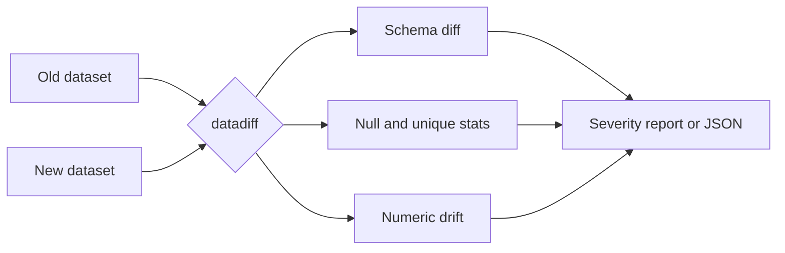

<h1 align="center">datadiff-engine</h1>

<p align="center">
  <b>What changed between yesterday's data and today's?</b><br>
  A lightweight dataset diff and drift analysis toolkit for data engineers.
</p>

<p align="center">
  <a href="https://pypi.org/project/datadiff-engine/"></a>
  <a href="https://github.com/Rohesen/datadiff-engine/actions/workflows/tests.yml"></a>
  <a href="https://www.python.org/"></a>
  <a href="LICENSE.txt"></a>
  <a href="https://pypi.org/project/datadiff-engine/"></a>
</p>

<p align="center">
  <a href="#install">Install</a> |
  <a href="#quick-start">Quick start</a> |
  <a href="#python-api">Python API</a> |
  <a href="#cli">CLI</a> |
  <a href="#drift-methodology">Methodology</a> |
  <a href="#roadmap">Roadmap</a>
</p>

<p align="center">
  
</p>

---

## Overview

Data pipelines can produce outputs that are technically valid but unexpectedly different. `datadiff-engine` compares two datasets and makes those differences visible, so you can catch silent regressions before they reach downstream consumers.

| Check | What it catches |
|---|---|
| Row counts | Unexpected growth or drops |
| Schema | Added or removed columns, data-type changes |
| Null rates | Silent data-quality regressions |
| Unique values | Cardinality changes and collapsed columns |
| Numeric statistics | Shifts in summary statistics |
| Numeric drift | Relative change in mean, median and P95 |
| Categoricals | Changes in categorical statistics |
| Severity | Configurable warning and critical thresholds |

Output is available as a Python object, a terminal report, or JSON for automation. The CLI supports CSV and Parquet.



## Install

```bash
pip install datadiff-engine
```

Requires Python 3.10 or newer.

## Quick start

Compare two files from the command line:

```bash
datadiff examples/orders_old.csv examples/orders_new.csv
```

Or compare two DataFrames in Python:

```python
import pandas as pd

from datadiff_engine import compare

old = pd.DataFrame({
    "customer_id": [1, 2, 3],
    "amount": [100, 200, 300],
})

new = pd.DataFrame({
    "customer_id": [1, 2, 3, 4],
    "amount": [100, 200, None, 500],
    "country": ["IN", "IN", "US", "IN"],
})

diff = compare(old, new)

print(diff)
```

In this example the comparison reports that the row count grew from 3 to 4, a new `country` column appeared, and `amount` gained a null value.

## Python API

### Column-level analysis

```python
amount = diff.column("amount")

print(amount.old_dtype)
print(amount.new_dtype)

print(amount.null_rate_old)
print(amount.null_rate_new)
print(amount.null_rate_change)

print(amount.severity)
```

### Numeric statistics and drift

```python
if amount.old_stats and amount.new_stats:
    print(amount.old_stats.mean)
    print(amount.new_stats.mean)

if amount.drift:
    print(amount.drift.mean_change_pct)
    print(amount.drift.has_drift)
```

### Custom thresholds

```python
from datadiff_engine import DiffConfig, compare

config = DiffConfig(
    warning_null_rate=0.10,
    critical_null_rate=0.50,
)

diff = compare(old, new, config=config)
```

### Excluding identifier columns from numeric drift

```python
config = DiffConfig(
    ignored_columns={"customer_id"},
)

diff = compare(old, new, config=config)
```

The column remains part of the comparison; only numeric drift analysis is skipped for it.

### Machine-readable output

```python
result = diff.to_dict()
```

The returned structure is JSON-friendly and designed for pipeline and automation use.

## CLI

| Task | Command |
|---|---|
| Compare CSV files | `datadiff old.csv new.csv` |
| Compare Parquet files | `datadiff old.parquet new.parquet` |
| Return JSON | `datadiff old.csv new.csv --json` |
| Ignore columns for numeric drift | `datadiff old.csv new.csv --ignore customer_id` |
| Show help | `datadiff --help` |

## Using it in automation

Because the CLI can emit JSON, it fits naturally into scheduled jobs and CI. For example, a GitHub Actions step that compares two snapshots and keeps the report as a build artifact:

```yaml
- name: Compare datasets
  run: |
    pip install datadiff-engine
    datadiff data/yesterday.parquet data/today.parquet --json > diff.json

- name: Upload diff report
  uses: actions/upload-artifact@v4
  with:
    name: datadiff-report
    path: diff.json
```

The same pattern works in Airflow, cron jobs, or any orchestrator that can run a shell command.

## Drift methodology

The current release uses a lightweight heuristic for numeric drift. It compares relative changes in selected summary statistics:

- Mean
- Median
- P95

A configurable threshold decides whether any tracked statistic changed beyond the allowed level.

This is intentionally simple and fast. It is **not intended to replace formal statistical distribution-drift tests**, such as KS or PSI based approaches. Use it as a quick first line of defense that tells you where to look.

## Supported inputs

| Interface | Formats |
|---|---|
| Python API | `pandas.DataFrame` |
| CLI | CSV, Parquet |

## Roadmap

- [x] Row, schema, null-rate and unique-value comparison
- [x] Numeric summary statistics and drift heuristics
- [x] Categorical statistics
- [x] Configurable severity thresholds
- [x] JSON output
- [x] CSV and Parquet support in the CLI
- [ ] More advanced statistical drift methods
- [ ] Better categorical drift analysis
- [ ] Datetime-aware profiling
- [ ] Polars support
- [ ] DuckDB integration
- [ ] Rich terminal output
- [ ] Markdown and HTML reports
- [ ] More configurable analysis rules

## Development

<details>
<summary><b>Set up a development environment</b></summary>

```bash
python -m venv .venv
```

Windows:

```powershell
.\.venv\Scripts\Activate.ps1
```

Install the project with development dependencies:

```bash
pip install -e ".[dev]"
```

Run tests:

```bash
pytest
```

Build and validate distributions:

```bash
python -m build
python -m twine check dist/*
```

</details>

<details>
<summary><b>Project structure</b></summary>

```text
datadiff-engine/
├── .github/
│   └── workflows/
│       ├── tests.yml
│       └── release.yml
├── examples/
│   ├── orders_old.csv
│   └── orders_new.csv
├── docs/
│   └── demo-terminal.png
├── src/
│   └── datadiff_engine/
│       ├── __init__.py
│       ├── compare.py
│       └── cli.py
├── tests/
│   └── test_compare.py
├── demo.py
├── LICENSE.txt
├── README.md
├── pyproject.toml
└── .gitignore
```

</details>

<details>
<summary><b>Release process</b></summary>

The project uses GitHub Actions for CI and PyPI publishing. The current release is `0.1.0`, published through GitHub Actions Trusted Publishing.

</details>

## Contributing

Issues, ideas and pull requests are welcome. Before submitting a change, run:

```bash
pytest
```

If you find the project useful, consider starring the repository.

## License

Released under the MIT License. See [LICENSE](LICENSE.txt).

## Author

**Rohesen Rajkamal Maurya**

Built as an open-source data-engineering utility for comparing datasets and understanding changes in pipeline outputs.
