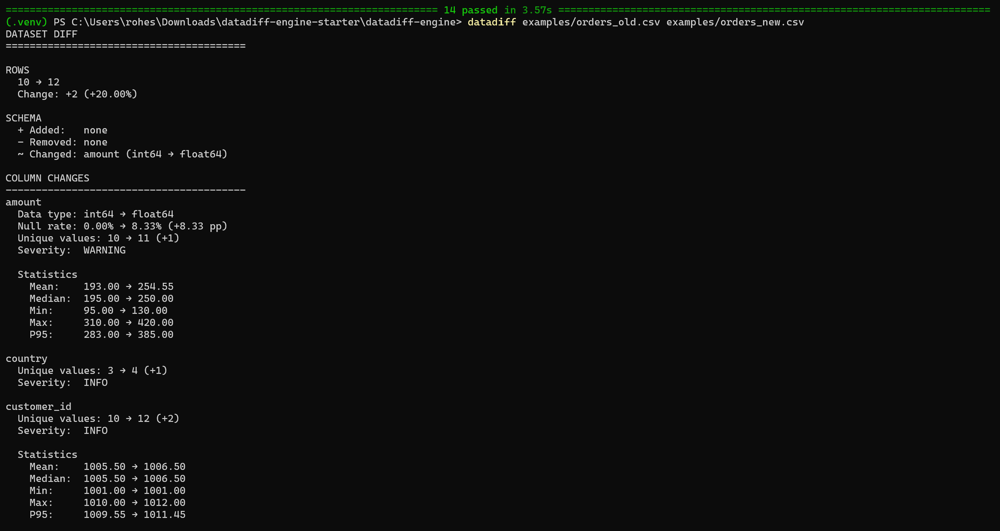

# datadiff-engine

[](https://pypi.org/project/datadiff-engine/)
[](https://github.com/Rohesen/datadiff-engine/actions/workflows/tests.yml)
[](https://www.python.org/)
[](LICENSE.txt)

> **A lightweight dataset diff and drift analysis toolkit for data engineers.**

Compare two datasets and quickly answer:

**What changed between yesterday's data and today's data?**

## Install

```bash
pip install datadiff-engine
```

## CLI demo 	 

```bash
datadiff examples/orders_old.csv examples/orders_new.csv
```




## Why datadiff-engine?

Data pipelines can produce outputs that are technically valid but unexpectedly different.

`datadiff-engine` makes those changes visible:

- Row-count changes
- Added or removed columns
- Data-type changes
- Null-rate changes
- Unique-value changes
- Numeric summary statistics
- Lightweight numeric drift heuristics
- Categorical statistics
- Configurable severity thresholds
- JSON output for automation
- CLI support for CSV and Parquet

## Python API

```python
import pandas as pd

from datadiff_engine import compare

old = pd.DataFrame({
    "customer_id": [1, 2, 3],
    "amount": [100, 200, 300],
})

new = pd.DataFrame({
    "customer_id": [1, 2, 3, 4],
    "amount": [100, 200, None, 500],
    "country": ["IN", "IN", "US", "IN"],
})

diff = compare(old, new)

print(diff)
```

### Column-level analysis

```python
amount = diff.column("amount")

print(amount.old_dtype)
print(amount.new_dtype)

print(amount.null_rate_old)
print(amount.null_rate_new)
print(amount.null_rate_change)

print(amount.severity)
```

### Numeric statistics and drift

```python
if amount.old_stats and amount.new_stats:
    print(amount.old_stats.mean)
    print(amount.new_stats.mean)

if amount.drift:
    print(amount.drift.mean_change_pct)
    print(amount.drift.has_drift)
```

### Custom thresholds

```python
from datadiff_engine import DiffConfig, compare

config = DiffConfig(
    warning_null_rate=0.10,
    critical_null_rate=0.50,
)

diff = compare(old, new, config=config)
```

### Excluding identifier columns from numeric drift

```python
config = DiffConfig(
    ignored_columns={"customer_id"},
)

diff = compare(old, new, config=config)
```

The column remains part of the comparison; numeric drift analysis is skipped for the ignored column.

## CLI

Compare CSV files:

```bash
datadiff old.csv new.csv
```

Compare Parquet files:

```bash
datadiff old.parquet new.parquet
```

Return JSON:

```bash
datadiff old.csv new.csv --json
```

Ignore columns for numeric drift:

```bash
datadiff old.csv new.csv --ignore customer_id
```

Show help:

```bash
datadiff --help
```

## Machine-readable output

```python
result = diff.to_dict()
```

The returned structure is designed to be JSON-friendly for pipeline and automation use.

## Drift methodology

The current release uses a **lightweight heuristic** for numeric drift.

It compares relative changes in selected summary statistics:

- Mean
- Median
- P95

A configurable threshold is then used to decide whether tracked statistics changed beyond the configured level.

This is intentionally simple and lightweight. It is **not intended to replace formal statistical distribution-drift tests**.

## Supported inputs

### Python API

- `pandas.DataFrame`

### CLI

- CSV
- Parquet

## Project structure

```text
datadiff-engine/
├── .github/
│   └── workflows/
│       ├── tests.yml
│       └── release.yml
├── examples/
│   ├── orders_old.csv
│   └── orders_new.csv
├── docs/
│   └── demo-terminal.png
├── src/
│   └── datadiff_engine/
│       ├── __init__.py
│       ├── compare.py
│       └── cli.py
├── tests/
│   └── test_compare.py
├── demo.py
├── LICENSE.txt
├── README.md
├── pyproject.toml
└── .gitignore
```

## Development

```bash
python -m venv .venv
```

Windows:

```powershell
.venv\Scripts\activate
```

Install the project with development dependencies:

```bash
pip install -e ".[dev]"
```

Run tests:

```bash
pytest
```

Build distributions:

```bash
python -m build
```

Validate them:

```bash
python -m twine check dist/*
```

## Release

The project uses GitHub Actions for CI and PyPI publishing.

Current release:

```text
0.1.0
```

The PyPI release was published through GitHub Actions Trusted Publishing.

## Roadmap

- More advanced statistical drift methods
- Better categorical drift analysis
- Datetime-aware profiling
- Polars support
- DuckDB integration
- Rich terminal output
- Markdown/HTML reports
- More configurable analysis rules

## Contributing

Issues, ideas, and pull requests are welcome.

Before submitting a change:

```bash
pytest
```

## License

MIT License See [LICENSE](LICENSE.txt)

## Author

**Rohesen Rajkamal Maurya**

Built as an open-source data-engineering utility for comparing datasets and understanding changes in pipeline outputs.
